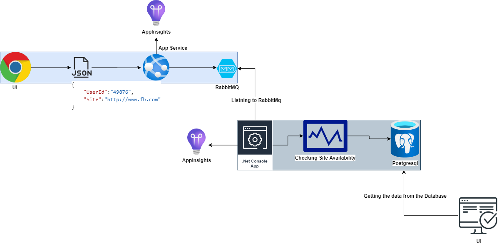
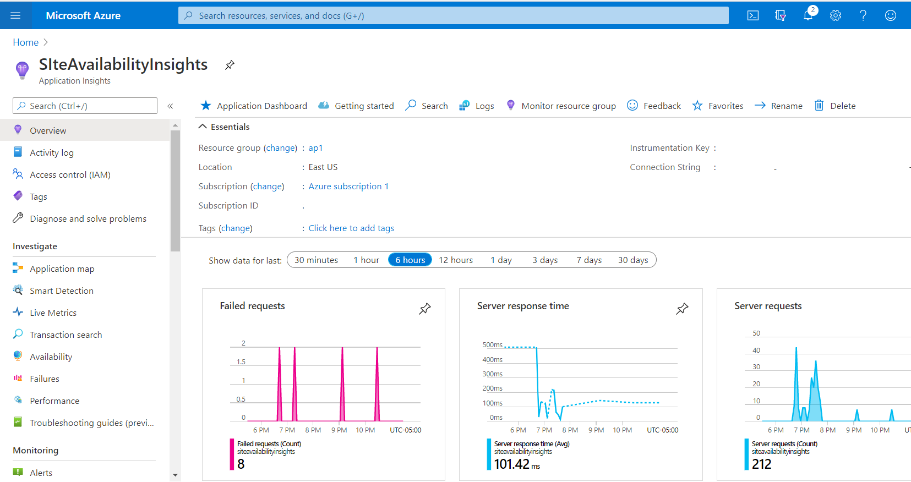

# SiteAvailabilityProcessor

# Architecture Diagram

SiteAvailabilityProcessor

# TechStack : 
.Net Core Console Application
# Services Used : 
RabbitMq Message Queue, PostgreSql.
# Features : 

This Console application is continuoisly listning to RabbitMq Message Queue for Message.
On receiving Message,

1. Checking whether the given input site is up or not.
2. Inserting this status history for that user in Postgresql, which will be used to fetch the historical data for the user.

# Deployement
This API is deployed as WebJobs in Azure.

# Docker Support

Docker File
Docker Compose File

# Telemetry

AppInsights

# SiteAvailabilityProcessor.Tests

Added Unit Tests for SiteAvailabilityProcessor API
